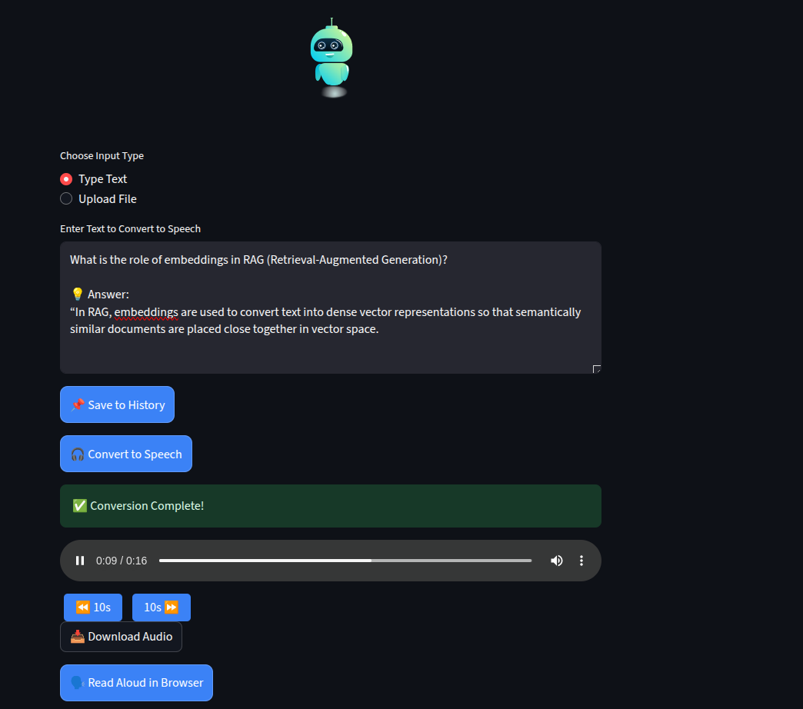

# 🗣️ Streamlit Text-to-Speech App (Edge-TTS)

Convert text to realistic speech using Microsoft's Edge TTS API with a beautiful, interactive UI built in Streamlit.

### 🚀 Features

- ✅ Convert text to speech using **Edge-TTS**
- ✅ **Voice selection**: English & Telugu (Male/Female)
- ✅ **Speed control**: Slow, Normal, Fast
- ✅ **Read Aloud** in browser (with word-by-word highlighting!)
- ✅ Upload `.txt` files and preview content
- ✅ Pronunciation Editor
- ✅ Convert & Download generated `.mp3` audio


---

### 🖼️ Preview




---

### 📦 Requirements

```bash
pip install -r requirements.txt
